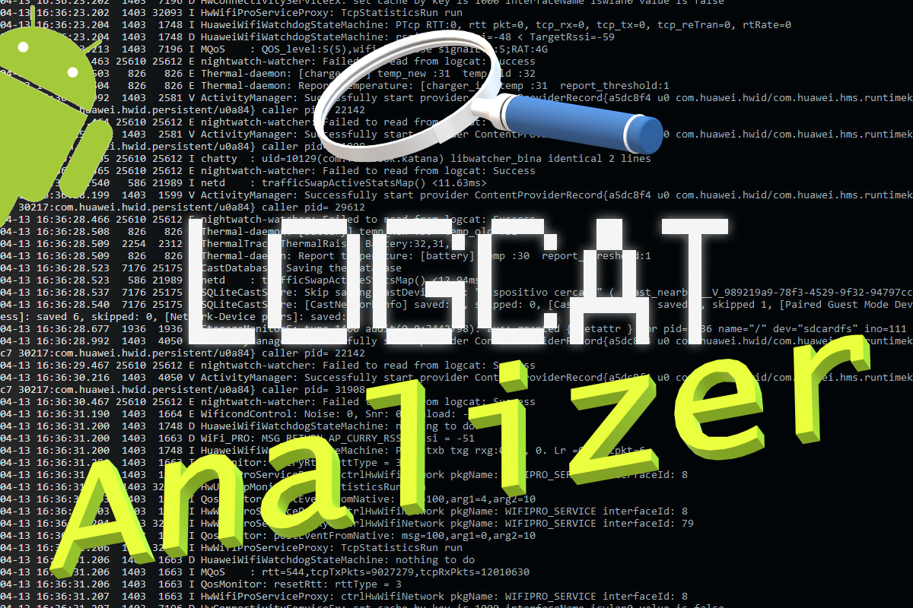

------------------------------------------------------------

<p align="center">
  
</p>
<h1 align="center"> Logcat Analyzer </h1>

------------------------------------------------------------


## Índice
1. [**El Proyecto**](#1-el-proyecto)
    - [Descripción del problema](#descripci%C3%B3n-del-problema)
    - [Necesidad de Big Data](#necesidad-de-big-data)
    - [Solución](#soluci%C3%B3n)
2. [**Dataset**](#2-dataset)    
3. [**Sobre el contenido del repositorio**](#3-sobre-el-contenido-del-repositorio)
4. [**Antes de empezar**](#4-antes-de-empezar)
    - [Pre-requisitos](#pre-requisitos)
    - [Preparación del entorno Android](#preparaci%C3%B3n-del-entorno-android-opcional) (opcional)
5. [**Funcionamiento de la aplicación**](#5-funcionamiento-de-la-aplicaci%C3%B3n)
6. [**Spark streaming**](#6-spark-streaming)
7. 
8. [**Conclusión**](#8-Conclusi%C3%B3n)
- [**Herramientas-utilizadas**](#herramientas-utilizadas)
- [**Autores**](#autores)

------------------------------------------------------------

## 1. **El proyecto**

**Logcat Analyzer** es un proyecto en el cual hemos realizado un procesamiento de logs en tiempo real (streaming) lanzados desde dispositivos Android y recopilados en una máquina Ubuntu con Spark en AWS. Para ello hemos desarrollado una app que actua como cliente mandando logs a un servidor en otra máquina distinta.

### Descripción del problema

### Necesidad de Big Data
Monitorizar los logs que genera un dispositivo Android localmente es una tarea pesada y costosa, ya que consumiría mucha batería además de sobrecargar la CPU.
Por este motivo hacemos uso del Big Data, para poder procesar toda la información que aporta cada log sabiendo que por cada segundo pueden llegar a generarse más de 500 logs.

### Solución
Nuestra solución se basa en obtener, monitorizar, analizar, filtrar y guardar los logs en archivos de texto con el objetivo de detectar acciones inusuales o maliciosas para garantizar la seguridad del usuario.
## 2. Dataset

## 3. Sobre el contenido del repositorio

Este repositorio está compuesto por 4 directorios principales y el archivo .apk instalable en Android:

- Android: Aquí encontrarás el proyecto de Android Studio entero con todos los ficheros que hemos obtenido al hacer build. Es necesario por si se quiere modificar o construir otra aplicación en el IDE de Android.
- src: Este directorio hace la función de acceso directo a los ficheros más importantes de _Android_. Aquí se almacenan las clases java de la app, los layout y el AndroidManifest.xml. Este último archivo recoge entre otras cosas los permisos que nuestra aplicación pide a Android.
- .apk: Esta es el aplicación que se debe instalar en el dispositivo Android.
- spark: Aquí recogemos los scripts necesarios para ejecutar en Apache Spark y conseguir enviar los logs por streaming.
- res: Este es un directorio donde almacenamos recursos necesarios para este repositorio. El usuario no debe prestar atención a este directorio.

## 4. Antes de empezar

_Estas instrucciones te permitirán entender el código del repositorio y obtener una copia del proyecto en funcionamiento en tu máquina local._

### Pre-requisitos

_Que cosas necesitas para instalar el software y como instalarlas_

Vamos a necesitar:
- Logcat Analyzer app (en este repositorio)
- Un teléfono con sistema operativo Android 6 o superior.
- Windows/macOS/Linux
- ADB (Android Debug Bridge) (opcional)
- Instancia Ubuntu 12 con Spark


### Preparación del entorno Android (opcional)

Los siguientes pasos son opcionales, para aquell@s que quieran hacer un análisis de todos los logs que lanza nuestro dispositivo Android.

Antes de instalar la aplicación debemos preparar nuestro dispositivo Android para aprovechar todas sus funcionalidades. 
Para poder tener acceso a todos los logs de logcat, se debe conceder el siguiente permiso a la aplicación:

```
android.permission.READ_LOGS
```

Este permiso es un tanto especial debido a su potencial peligrosidad en manos ajenas, es por eso que el permiso _Read_Logs_ sólo lo tienen las aplicaciones que forman parte del firmware del sistema. Para conseguir que nuestra aplicación se beneficie de este permiso, tenemos dos opciones:
#### 1. Rootear el dispositivo Android
Es una vía muy poco aconsejable por la dificultad y la peligrosidad que conlleva tener acceso root, por no hablar de las incompatibilidad, actualizaciones y posibles pérdidas de memoria.

#### 2. Utilizar ADB
Por la sencillez a la hora de utilizar el Android Debug Bridge, vamos a utilizar este método. ADB es una herramienta de línea de comandos que nos permitirá comunicarnos con nuestro móvil a través de una consola desde el PC. El comando adb permite realizar una variedad de accioens en el dispositivo, como instalar y depurar apps, y proporciona acceso a una shell de Unix que puedes usar para ejecutar distintos comandos en un dispositivo. 

En este caso, usaremos el ADB para conceder permisos a nuestra app.

Estos son los pasos a seguir:

### 1. Activar opciones de desarrollador


Dirígete a la sección _Acerca del teléfono_ situada al final de los ajustes de Android.
Una vez ahí, debes pulsar 7 veces sobre el apartado _Número de compilación_ (o _Versión del Kernel_ depende del dispositivo) hasta que salga un pop-up que te confirmará que las opciones de desarrollador están ya activadas.
Al volver a la ventana de ajustes, ahora veremos la sección de Opciones de Desarrollador.

### 2. Descargar ADB en el PC

Descarga SDK para Windows/macOS/Linux: https://developer.android.com/studio/releases/platform-tools

### 3. Conceder permisos
- Conecta tu teléfono via USB al PC.
- Dentro de _Opciones de Desarrollador_, activa la _Depuración por USB_. Te saldrá un mensaje pidiendo tu confirmación, pulsa _OK_.


- En el PC, extraemos el contendio del .zip que te has descargado previamente con el ADB y abre una consola dentro de la carpeta _platform-tools_.


- Con el siguiente comando comprobaremos que se detecta el móvil:
```
adb devices
```

- A continuación daremos permisos a nuestra aplicación:
```
adb shell pm grant com.app.netcat android.permission.READ_LOGS
```


- Ya podríamos quitar el USB del PC. 

Recordamos que estos pasos son opcionales y con ellos únicamente conseguiremos analizar todos los logs que se lanzan.


## 5. Funcionamiento de la aplicación.

Una vez instalemos la .apk del repositorio y abramos la aplicación, obtendremos la siguiente interfaz:


#### 1. En este campo ingresaremos la dirección IP a la que queremos conectarnos.
#### 2. De igual forma, en este campo especificamos el puerto del servidor.
#### 3. Aquí tenemos la opción de añadir palabras clave para poder filtrar los logs. Las keywords deben estar separadas por comas.
#### 4. El botón _SYSTEM APPS_ desplegará los paquetes del sistema. Aquellos paquetes seleccionados se añadiran al filtro.
#### 5. El botón _USER APPS_ desplegará los paquetes de las aplicaciones instaladas por el usuario. Aquellas aplicaciones seleccionadas se añadiran al filtro.
#### 6. El _STATUS_ mostrará el estado de la conexión con el servidor (OFFLINE / RUNNING / STOPPED).
#### 7. El botón _START_ conectará el dispositivo con el servidor seleccionado.
#### 8. El botón _STOP_ detendrá la conexión.


- Introduciendo la keyword _cam_:


- Selección de paquetes del sistema con el botón _SYSTEM APPS_:


- Selección de aplicaciones instaladas con el botón _USER APPS_:


## 6. Spark Streaming

_Texto de ejemplo_

```
Da un ejemplo
```
## 8. Conclusión
------------------------------------------------------------

## Herramientas utilizadas

* [Spark Streaming](https://spark.apache.org/docs/latest/streaming-programming-guide.html) - Creación del servidor y procesamiento de logs
* [Android Studio](https://developer.android.com/studio?hl=es) - Usado para crear la aplicación
* [AWS](https://aws.amazon.com/es/) - Usado para lanzar la instancia de linux con Spark

## Autores

* **Ramón Costales de Ledesma** - [Rymond3](https://github.com/Rymond3)
* **Jose Ignacio Daguerre Garrido** - [joseignaciodg](https://github.com/joseignaciodg)
* **Daniel Puente Arribas** - [dapuente13](https://github.com/dapuente13)
